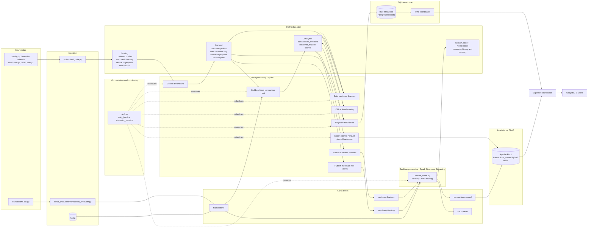

# FinPulse-Fraud

Fraud detection & transaction analytics on a HDFS / Spark / Kafka / Spark Structured Streaming / Pinot / Trino-on-HMS / Superset / Airflow stack, following the **Lambda** pattern (Kafka -> Spark Structured Streaming -> Pinot for streaming, Spark + HMS on HDFS + Trino for batch / granular DWH).

## Architecture

FinPulse follows a Lambda-style data architecture:

- **Batch path:** local source files land in HDFS, Spark curates dimensions, joins Kafka transaction facts into `analytics.transactions_enriched`, builds customer features, scores fraud rules offline, registers Parquet datasets in Hive Metastore, and serves them through Trino.
- **Realtime path:** a Kafka producer streams raw transactions into `transactions`; Spark Structured Streaming enriches each micro-batch with customer and merchant feature topics, computes fraud rules, emits scored transactions and fraud alerts, and persists stream state/checkpoints in HDFS.
- **Serving path:** Trino serves granular warehouse tables from HDFS/HMS, while Pinot serves the `transactions_scored` hybrid OLAP table from offline Parquet exports plus realtime Kafka messages. Superset connects to both serving layers.
- **Orchestration:** Airflow runs the daily batch DAG and monitors the long-running streaming scorer.

## Data

Source datasets live in `data/` and were copied from [here](https://github.com/prof-tcsmith/ism6562s26-class/tree/main/final-projects/data/05-finpulse-fraud). All files are gzip-compressed; Spark reads gzipped files (`.csv.gz` and `.json.gz` natively), so no manual `gunzip` is needed

## References

- [Data architecture 101](https://vutr.substack.com/p/data-architecture-101)
- [The Hadoop Distributed File System](https://vutr.substack.com/p/i-spent-8-hours-reading-the-paper-523)
- [The Overview Of Apache Spark](https://vutr.substack.com/p/the-overview-of-apache-spark)
- [If you're learning Kafka, this article is for you](https://vutr.substack.com/p/if-youre-learning-kafka-this-article)
- [A glimpse of Apache Pinot, the real-time OLAP system from LinkedIn](https://vutr.substack.com/p/a-glimpse-of-apache-pinot-the-real)
- [What is Apache Hive?](https://vutr.substack.com/p/what-is-apache-hive)
- [8 minutes to understand Presto](https://vutr.substack.com/p/8-minutes-to-understand-presto)
- [Data engineering system design: 11 data sourcing problems](https://vutr.substack.com/p/data-engineering-system-design-11)
- [Data engineering system design: 9 data serving problems](https://vutr.substack.com/p/data-engineering-system-design-9)
- [Data engineering system design: 9 data processing problems](https://vutr.substack.com/p/data-engineering-system-design-9-4c5)
- [Data Engineering System Design: Orchestration + Apache Airflow](https://vutr.substack.com/p/data-engineering-system-design-orchestration)
