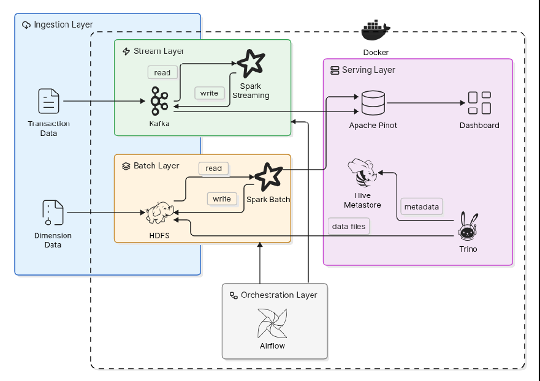

# FinPulse-Fraud

Fraud detection & transaction analytics on a HDFS / Spark / Kafka / Spark Structured Streaming / Pinot / Trino-on-HMS / Superset / Airflow stack, following the **Lambda** pattern (Kafka -> Spark Structured Streaming -> Pinot for streaming, Spark + HMS on HDFS + Trino for batch / granular DWH). The project brief is described [docs/scenario.md](docs/scenario.md).

## Architecture



## Data Flow Diagram


FinPulse follows a Lambda-style data architecture:

- **Batch path:** local source files land in HDFS, Spark curates dimensions, joins Kafka transaction facts into `analytics.transactions_enriched`, builds customer features, scores fraud rules offline, registers Parquet datasets in Hive Metastore, and serves them through Trino.
- **Realtime path:** a Kafka producer streams raw transactions into `transactions`; Spark Structured Streaming enriches each micro-batch with customer and merchant feature topics, computes fraud rules, emits scored transactions and fraud alerts, and persists stream state/checkpoints in HDFS.
- **Serving path:** Trino serves granular warehouse tables from HDFS/HMS, while Pinot serves the `transactions_scored` hybrid OLAP table from offline Parquet exports plus realtime Kafka messages. Superset connects to both serving layers.
- **Orchestration:** Airflow runs the daily batch DAG and monitors the long-running streaming scorer.

## Data

Source datasets live in `data/` and were copied from [here](https://github.com/prof-tcsmith/ism6562s26-class/tree/main/final-projects/data/05-finpulse-fraud). All files are gzip-compressed; Spark reads gzipped files (`.csv.gz` and `.json.gz` natively), so no manual `gunzip` is needed


## Getting Started

Follow these steps to bring up the local FinPulse stack, load the sample data, and run the batch and streaming pipelines.

### 1. Prerequisites

Install the following tools on your machine:

- Docker with Docker Compose v2
- Python 3.10+ for the local helper scripts
- `curl` and `bash`

Make sure Docker is running, then clone the project and enter the repository:

```bash
git clone <repo-url>
cd FinPulse-Fraud
```

The Hive Metastore needs the PostgreSQL JDBC driver in `docker/hive-metastore/jars/`. The driver is already included in this repository. If it is missing, download it with:

```bash
make hive-deps
```

On Linux, set `AIRFLOW_UID` before starting Airflow so generated files are owned by your user:

```bash
echo "AIRFLOW_UID=$(id -u)" > .env
```

### 2. Start the Stack

Start all services with Docker Compose:

```bash
make up
```

Wait until the main services are healthy:

```bash
docker compose ps
```

Useful local UIs:

- HDFS NameNode: http://localhost:9870
- Spark master: http://localhost:8080
- Airflow: http://localhost:8081 (`airflow` / `airflow`)
- Trino: http://localhost:8086
- Pinot controller: http://localhost:9100
- Superset: http://localhost:8088 (`admin` / `admin`)

### 3. Land Source Data in HDFS

Copy the gzipped dimension datasets from `data/` into the HDFS landing zone:

```bash
python3 scripts/land_data.py
```

Verify the files landed:

```bash
docker compose exec -T namenode hdfs dfs -ls -R /landing
```

### 4. Seed Kafka Transactions

Create the `transactions` topic:

```bash
docker compose exec -T kafka /opt/kafka/bin/kafka-topics.sh \
  --bootstrap-server kafka:9094 \
  --create --if-not-exists \
  --topic transactions \
  --partitions 6 \
  --replication-factor 1 \
  --config retention.ms=-1
```

Publish sample transactions from `data/transactions.csv.gz`:

```bash
docker compose exec -T kafka-producer \
  python /opt/producers/transaction_producer.py --rate 1000 --limit 50000
```

Check that Kafka received messages:

```bash
docker compose exec -T kafka /opt/kafka/bin/kafka-get-offsets.sh \
  --bootstrap-server kafka:9094 \
  --topic transactions
```

### 5. Register Pinot Tables

Register the `transactions_scored` schema plus realtime and offline table configs:

```bash
bash scripts/load_tables.sh
```

### 6. Run the Batch Pipeline

Use Airflow to run the full daily batch flow:

```bash
docker compose exec -T airflow-apiserver airflow dags unpause daily_batch
docker compose exec -T airflow-apiserver airflow dags trigger daily_batch
```

Open Airflow at http://localhost:8081 and wait for the `daily_batch` run to complete. The DAG curates dimensions, builds the enriched fact table, creates customer features, scores transactions offline, exports Pinot offline files, and ingests them into Pinot.

After the DAG succeeds, verify the Hive/Trino serving layer:

```bash
docker compose exec -T trino-coordinator trino \
  --catalog hive \
  --execute 'SHOW SCHEMAS'
```

Verify the Pinot serving layer:

```bash
curl -fsS -X POST http://localhost:8099/query/sql \
  -H 'Content-Type: application/json' \
  -d '{"sql":"SELECT COUNT(*) FROM transactions_scored"}'
```

### 7. Run the Realtime Scoring Pipeline

Publish customer and merchant lookup topics that the streaming scorer uses for enrichment:

```bash
docker compose exec -T spark-master /opt/spark/bin/spark-submit \
  --master spark://spark-master:7077 \
  --packages org.apache.spark:spark-sql-kafka-0-10_2.13:4.0.0 \
  /opt/spark/work-dir/jobs/publish/publish_customer_features.py

docker compose exec -T spark-master /opt/spark/bin/spark-submit \
  --master spark://spark-master:7077 \
  --packages org.apache.spark:spark-sql-kafka-0-10_2.13:4.0.0 \
  /opt/spark/work-dir/jobs/publish/publish_merchant_directory.py
```

Start the Spark Structured Streaming scorer:

```bash
docker compose exec -T spark-master /opt/spark/bin/spark-submit \
  --master spark://spark-master:7077 \
  --packages org.apache.spark:spark-sql-kafka-0-10_2.13:4.0.0 \
  /opt/spark/work-dir/jobs/kafka_consumer/stream_score.py
```

In another terminal, send more transactions while the streaming job is running:

```bash
docker compose exec -T kafka-producer \
  python /opt/producers/transaction_producer.py --rate 200 --limit 10000
```

Inspect scored transactions or fraud alerts:

```bash
docker compose exec -T kafka /opt/kafka/bin/kafka-console-consumer.sh \
  --bootstrap-server kafka:9094 \
  --topic transactions-scored \
  --from-beginning \
  --max-messages 5

docker compose exec -T kafka /opt/kafka/bin/kafka-console-consumer.sh \
  --bootstrap-server kafka:9094 \
  --topic fraud-alerts \
  --from-beginning \
  --max-messages 5
```

### 8. Run Smoke Tests

Run smoke tests for the core services:

```bash
make smoke
```

### 9. Stop or Reset

Stop containers while keeping data volumes:

```bash
docker compose down
```

Remove containers and volumes for a clean reset:

```bash
docker compose down -v
```

## First-time bring-up

```bash

```

## Makefile

| **Target** | **What is does?** |
|-|-|
| `make up` | Start the full stack |
| `make up-core` | HDFS + Spark + Kafka only |
| `make up-stream` | One-time: download Postgres JDBC driver to `docker/hive-metastore/jars/` |
| `make up-bi` | Pinot + Superset + HMS + Presto |
| `make down`| Stop containers, keep volumes |
| `make nuke` | Stop and delete all volumes |