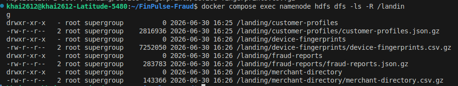

# Stage 1 - Data Lake Foundation

## Tasks

- Design and create the HDFS directory structure (landing / curated / analytics zones)
- Load the provided raw datasets into the landing zone
- Choose appropriate file formats for each data source and justify your choices (CSV, JSON, Avro, Parquet — consider schema evolution, compression, query patterns)
- Set replication factors based on data criticality and volume
- Document your data lake architecture with a diagram


## Decisions
 


## Implementation

### Why HDFS, but not Object Store (like S3)

Object stores (such as S3, GCS, etc.) are the preferred options for most current data storage systems, but in this project I implemented HDFS because it was a mandatory requirement.

A brief comparison between HDFS and S3


### Setup

HDFS is implemented with 1 NameNode (`namenode`) and 2 DataNodes (`datanode-1` and `datanode-2`). All live in `docker-compose.yml`

### Configurations in HDFS

[core-site.xml](../docker/hadoop-server/core-site.xml)
- When starting up, each DataNode is registered to NameNode through `fs.defaultFS=hdfs://namenode:9000` so they can communicate with each other

[hdfs-site.xml](../docker/hadoop-server/hdfs-site.xml)
- Block replication is configured in `dfs.replication`, since there are 2 DataNodes on the cluster, the value is set to 2
- Disables the hostname-to-IP consistency check during DataNode registration via `dfs.namenode.datanode.registration.ip-hostname-check=false`

### Landing Script

When run the Python script [land_data.py](../scripts/land_data.py), the five commands are executed sequentially (e.g., for `merchant-directory.csv.gz`)

```bash
# Create the per-dataset directory in HDFS
docker compose exec -T namenode hdfs dfs -mkdir -p /landing/merchant-directory

# Copy the local file into the namenode container's /tmp
# Required for the put command in the next command
docker compose cp data/merchant-directory.csv.gz namenode:/tmp/

# Stream tmp/ dir into merchant-directory/ dir
docker compose exec -T namenode hdfs dfs -put \
    /tmp/merchant-directory.csv.gz \
    /landing/merchant-directory/

# Tidy up the tmp copy
docker compose exec -T namenode rm /tmp/merchant-directory.csv.gz

# Set the replication factor of the files in merchant-directory/
docker compose exec -T namenode hdfs dfs -setrep 2 /landing/merchant-directory/ 
```

### Verification

After the script completed, you can test the results with `docker compose exec namenode hdfs dfs -ls -R /landing` (list of stats of the subdirectories/files in `landing/` directory)


