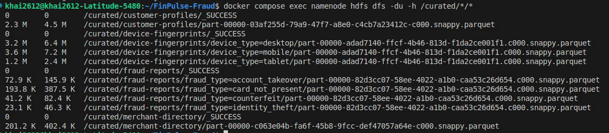

# Stage 2: Batch Transformation Pipeline

## Tasks

Read raw data from the HDFS landing zone using PySpark
Clean, standardize, and validate the data (handle nulls, fix types, deduplicate)
Join multiple data sources to create enriched datasets
Aggregate data to answer the company's business questions
Write curated and analytics outputs as Parquet with appropriate partitioning

## Decisions


## Implementation

### Setup

In this project, Spark cluster is implemented with 1 master node and 2 worker nodes (in `docker-compose.yml`), Spark apps are deployed in **client mode** with **Spark Standalone cluster manager**

To enable Spark to read and write from HDFS
- Set `HADOOP_CONF_DIR` to a location containing the configuration files (e.g., `/etc/hadoop/conf`)
- Add two Hadoop configuration files (in [hadoop-client/](../../docker/hadoop-client/)) to Spark's classpath
    - `hdfs-site.xml`, which provides default behaviors for the HDFS client
    - `core-site.xml`, which sets the default filesystem name

### Spark curate jobs

Spark curate jobs are written in `jobs/curate/*.py` in which each job reads from the `landing/` (`.gz` file) and writes to the `curated/` (`.parquet` file).

After defining the Spark jobs, these jobs will be submitted to the `master` process via

```bash
docker compose exec spark-master /opt/spark/bin/spark-submit \
    --master spark://spark-master:7077 \
    path_to_python_file` # e.g., .../work-dir/jobs/curate/curate_merchants.py
```

### Verification

`docker compose exec namenode hdfs dfs -du -h /curated/*/*`: Displays sizes of files in `curated/` directory, a note that the second column in result is disk space consumed with all replicas (e.g., 2 replicas)


