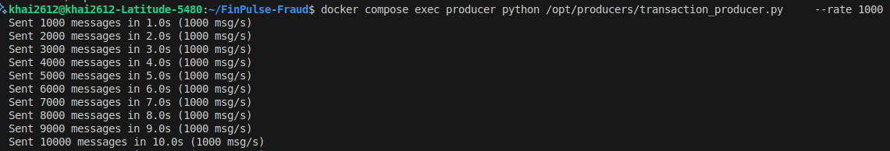

# Stage 3: Real-Time Streaming Layer

## Tasks

- Design Kafka topics for the company’s streaming data sources
- Build a producer that simulates real-time events from your scenario
- Implement Spark Structured Streaming consumers
- Apply windowed aggregations and/or real-time alerting logic
- Decide and justify your architecture: Lambda (batch + stream) or Kappa (stream only)

## Decisions


## Implementation

### Setup Kafka

Kafka broker and controller are deployed in the same container `kafka` (run Kafka in `KRaft` mode)

Explain the environment variables in `kafka` container

```bash
# BROKER-AND-CONTROLLER LEVEL CONFIGURATIONS

KAFKA_NODE_ID=0 # node ID associated with the roles in process.roles 
KAFKA_PROCESS_ROLES=broker,controller # the roles that Kafka process plays
KAFKA_LISTENERS=INTERNAL://:9094,CONTROLLER://:9093,EXTERNAL://:9092 # a list of listeners
KAFKA_ADVERTISED_LISTENERS=INTERNAL://kafka:9094,EXTERNAL://localhost:9092 # addresses that the Kafka brokers will advertise to clients
KAFKA_LISTENER_SECURITY_PROTOCOL_MAP=CONTROLLER:PLAINTEXT,INTERNAL:PLAINTEXT,EXTERNAL:PLAINTEXT # map each security protocol for each listener name
KAFKA_CONTROLLER_QUORUM_BOOTSTRAP_SERVERS=kafka:9093 # endpoints for bootstrapping the cluster metadata
KAFKA_CONTROLLER_LISTENER_NAMES=CONTROLLER # listeners used by the controller
KAFKA_CONTROLLER_QUORUM_VOTERS=0@kafka:9093 # map of id/endpoint for the set of voters
KAFKA_INTER_BROKER_LISTENER_NAME=INTERNAL # Name of listener used for communication between brokers
KAFKA_LOG_DIRS=/var/lib/kafka/data # directory the log data is stored

# TOPIC-AND-PARTITION LEVEL CONFIGURATIONS
KAFKA_AUTO_CREATE_TOPICS_ENABLE=true # enable auto creation of topic on server
KAFKA_OFFSETS_TOPIC_REPLICATION_FACTOR=1 # replication factor for the offsets topic
KAFKA_TRANSACTION_STATE_LOG_REPLICATION_FACOTR=1 # replication factor for the transaction topic
KAFKA_TRANSACTION_STATE_LOG_MIN_ISR=1 # minimum no. replicas that must acknowledge a write to transaction topic in order to be considered successful
KAFKA_GROUP_INITIAL_REBALANCE_DELAY_MS=0 # amount of time the group coordinator will wait for more consumers to join a new group before performing the first rebalance
```

After `kafka` is healthy, `kafdrop` and `producer` (Python app) containers are up and running
- `kafdrop` is a web UI for viewing Kafka topics and browsing consumer groups. The tool displays information such as brokers, topics, partitions, consumers, and lets you view messages
- `producer` works as a Kafka producer that read transaction data and stream it into Kafka `transaction` topic. Details in [transaction_producer.py](../../producers/transaction_producer.py)


Security protocols (https://kafka.apache.org/43/security/listener-configuration/)


### Running Kafka producer

Inside `kafka` container, create a Kafka topic to store messages: `docker compose exec kafka /opt/kafka/bin/kafka-topics.sh --create --if-not-exists --topic transactions --bootstrap-server kafka:9094`

Run a Kafka producer (Python app) to simulate real-time events from transaction data: `docker compose exec producer python /opt/producers/transaction_producer.py --rate 1000`




### Verification


