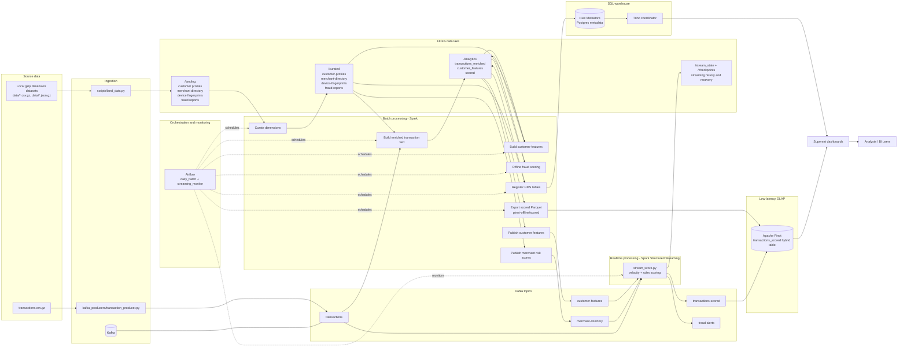

# Dataflow — end to end

This doc explains how the five raw datasets in `data/` move through the stack and end up powering two consumers - **Superset dashboards** and the **analysis notebook** - both of which read through the same two serving engines: **Pinot** for pre-aggregated streaming queries and **Trino on the Hive Metastore** for granular ad-hoc SQL over HDFS Parquet.

This doc tells you **what data is moving and why**.

## Mental model: one Kafka topic, two consumers, two serving engines

The fact stream (`transactions`) lives only in Kafka. The four other datasets (customers, merchants, devices, fraud-reports) live only in HDFS - they're slowly-changing dimensions, not events. There is no `/landing/transactions/` or `/curated/transactions/`; the producer publishes the `.csv.gz` straight to Kafka and that topic is the system's record of truth for transactions.

**Two consumers read the same Kafka topic for two purposes**:
1. **Spark - batch consumer**. Nightly, Spark reads the `transactions` topic by offset range, joins each event against the four HDFS dimensions, and writes the enriched fact + customer-features + offline-scored outputs back to HDFS under `/analytics/`. These are the source for Pinot's offline-table segments and the granular Parquet that Presto serves via HMS - both of which the notebook and Superset query (no consumer reads `/analytics/*` path-based).
2. **Flink - streaming consumer**. Continuously, Flink reads the same topic, applies rules + a keyed velocity window, and writes to two more Kafka topics: `transactions-scored` (every event, feeds Pinot's real-time table) and `fraud-alerts` (risk ≥ 2, a live ticker for Superset).

**Two serving engines fan out from the lake, not one**:
1. Pinot — pre-aggregated, sub-second. A hybrid table whose real-time half tails Kafka transactions-scored and whose offline half is rebuilt nightly from /analytics/transactions_enriched/. Fixed schema, segment-indexed, designed for live dashboards at high concurrency. Best for "what's the fraud rate this hour?".
2. Trino-on-HMS — granular, second-scale. A SQL engine that reads the same /curated/* and /analytics/* Parquet, but via the Hive Metastore catalog rather than path-based access. Spark's saveAsTable writes the bytes and registers the table in HMS in one call; Presto discovers tables by querying HMS over Thrift. Bytes still live in HDFS — three concerns, three independent components: storage (HDFS), catalog (HMS-on-Postgres), engine (Presto). Best for "join 3 tables, slice by 4 columns, show me every row".
The two paths meet in three places:

At the customer_features Parquet — Spark batch writes it; Flink broadcast-loads it. Without the batch path, Flink has no normal-behavior baseline to compare each event against.
At the Pinot hybrid table — Flink writes the real-time copy via Kafka; nightly Spark writes the reconciled offline copy from HDFS. Superset queries the logical union — yesterday from the audit-grade reconciled offline segments, today from real-time.
At the Hive Metastore catalog — Spark saveAsTable registers every /curated/* and /analytics/* table in HMS. Presto reads them through the Hive connector; both Superset and the analysis notebook reach this data through Presto, not via path-based PySpark reads. HMS is the central catalog that lets every consumer see the same data Spark wrote, without each engine having to know where on HDFS each table lives.

## Where the raw files come from

`data/*.gz` was produced by `scripts/generate_data.py` - a one-time offline generator that synthesizes the five datasets with planted fraud signals (seed `2041` for reproducibility). It is not a runtime component: it runs once on the host, writes the gz files, and is never invoked again

## End-to-end diagram

## Batch flow - walkthrough

## Streaming flow - walkthrough

## How a single transaction travels

To make it concrete, follow one row from `data/transactions.csv.gz`:

1. **Publish into Kafka**. The producer reads the row from the `.gz` file and publishes it to Kafka topic `transactions`, keyed by `card_id`.
2. **Flink consumes (streaming)**. Within seconds, the Flink job sees the event, looks up the broadcast customer-features state, applies the rules + sliding-window velocity, computes a risk score, and - inside one Flink checkpoint - writes a record to `transactions-scored` (always) and `fraud-alerts` (if `risk_score >= 2`).
3. **Pinot ingests in real-time**. Pinot's server tails `transactions-scored` and the row appears in the real-time table within seconds. Superset sees it on any dashboard scoped to "today" - the broker is reading the real-time path.
4. **Spark consumes (batch)**. The nightly Airflow DAG triggers Spark, which reads the same Kafka topic (`transactions`) by offset range, joins against `/curated/*` dims, and writes `/analytics/transactions_enriched/dt=...`, then `/analytics/customer_features/` and `/analytics/scored/`. Same Spark job builds Pinot offline segments and uploads them - the broker switches that day to the offline path automatically, and any late-arriving events sent to Flink's side output get folded in.
5. **Notebook**. The analysis notebook queries the serving layer (Trino for granular SQL on `/analytics/*` via HMS, Pinot for pre-aggregated trends) to answer the business questions. Same access pattern as Superset; the notebook never reads `/analytics/*` path-based, so HMS stays the single source of truth for what tables exist.